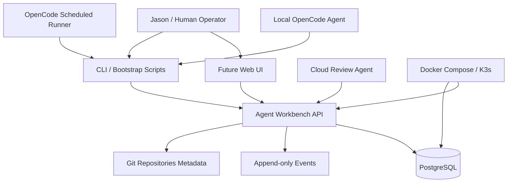

# Project Architecture

## Overview

`Agent Workbench` should start as a modular monolith: one deployable API, one PostgreSQL database, and clear internal modules. This avoids the consistency and operational overhead of separate services while still keeping domain boundaries explicit.

Git remains the source of truth for code. PostgreSQL becomes the source of truth for agent coordination state.

## System Diagram

## Modules

- `projects`: project registry, Git source location, type, environment, default agent, and metadata.
- `project_sections`: project modules/sections such as API, web, CLI, chapter, lesson, article section, or infrastructure area.
- `project_status`: current project or section status, phase, blocker/reason/details, and status history.
- `project_tasks`: task CRUD, section association, phase, priority, dependencies, state machine, leases, and completion evidence.
- `agents`: agent definitions, capabilities, default model/provider hints, and assignment preferences.
- `runs`: scheduled/manual run records, heartbeat, validation commands, outputs, and result state.
- `events`: append-only audit log for state changes, notes, claims, completions, review updates, and validation.
- `reviews`: cloud review findings, severity, status, refactor tasks, and signoff.

## Data Flow

1. Jason creates or imports a project with type, Git source, and default agent hints.
2. Default sections/modules may be created from the project type, or custom sections can be added.
3. Status records and tasks are created at either project-wide scope or section/module scope.
4. Tasks are created manually, from templates, or from review findings.
5. An agent asks for the next available task.
6. The API atomically claims a task with a lease and records an event.
7. The agent heartbeats and appends run events while working.
8. The agent completes, blocks, or fails the task with validation evidence.
9. The API records state transitions transactionally and keeps append-only history.
10. Markdown summaries can be generated or manually updated for agent context handoff.

## Database Design Principles

- Use the same logical schema across local, dev, stage, and prod.
- Prefer separate databases or hosts per environment with a stable `agent_workbench` schema.
- Use `APP_ENV=local|dev|stage|prod` to select the active database target.
- Deployed runtime should default to prod, but local development commands must explicitly select local.
- Use UUID primary keys unless a clear reason emerges otherwise.
- Model project sections/modules as first-class `project_sections` rows.
- Use nullable `project_section_id` on status records and tasks for project-wide/general work.
- Track `phase` on both status records and tasks.
- Start with phases: `planning`, `research`, `implementation`, `testing`, and `review`.
- Use `created_at`, `updated_at`, and optimistic `version` fields on mutable rows.
- Use lease fields such as `claimed_by`, `claimed_until`, and `lease_version` for tasks.
- Use append-only `events` for durable state-change evidence.
- Use idempotency keys for retryable agent actions.
- Keep secrets out of application tables unless a deliberate encrypted secret-store design is added later.

## API Design Principles

- Prefer canonical multi-project routes such as `/api/projects/{project_id}/tasks` and `/api/projects/{project_id}/sections`.
- Avoid URL versioning initially; document compatibility and deprecation policy instead.
- Use explicit action routes for state transitions where atomic behavior matters, such as `/api/tasks/{task_id}/claim`.
- Keep response shapes stable and documented.
- Return structured errors with machine-readable codes and human-readable messages.

## Deployment Shape

- Local: Docker Compose with API and PostgreSQL container.
- Dev/stage: external PostgreSQL servers `postgresql-dev` and `postgresql-stage`.
- Production: Docker Compose VM first; K3s is future work.
- Production database host: expected `postgresql`/`postgresql.taylor.lan`; credentials injected via deployment secrets.
- Local project discovery roots: `~/projects/ai`, `~/projects/courses`, `~/projects/dev`, and `~/projects/infra`, configurable rather than hard-coded.
- Ansible project reference: `~/projects/infra/ansible`; agents must not read or copy secrets.

## Decisions

- Start with a modular monolith, not separate APIs/services.
- Keep Markdown files as bootstrap/context aids, but move coordination truth to Postgres as soon as possible.
- Add cloud review/refactor before real use.
