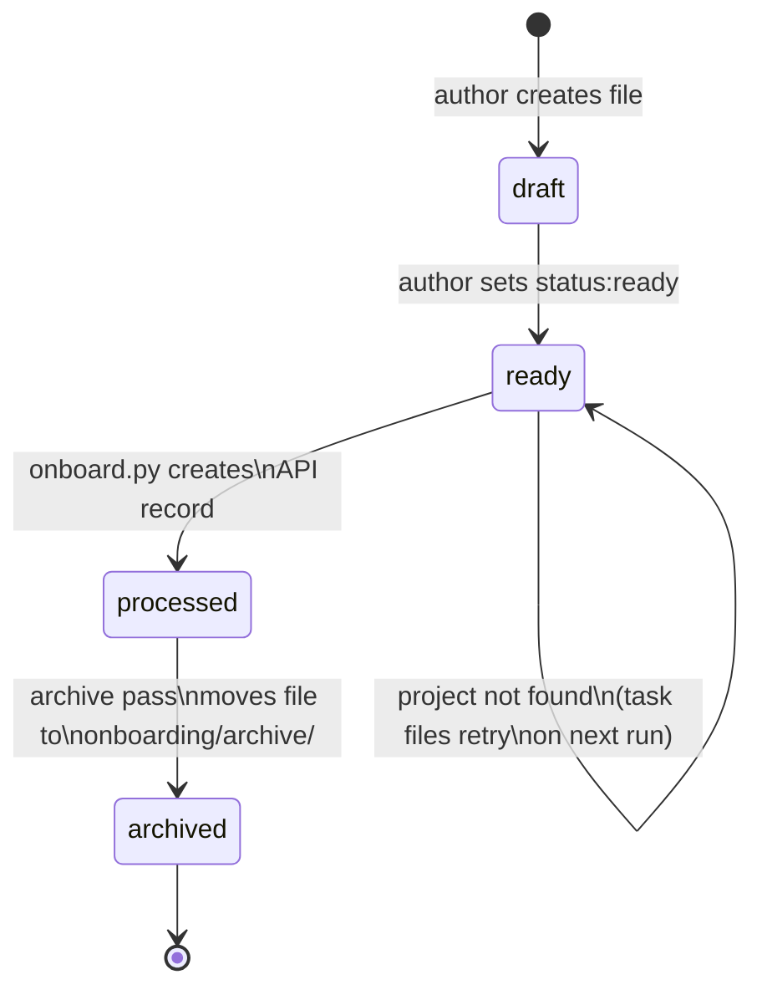
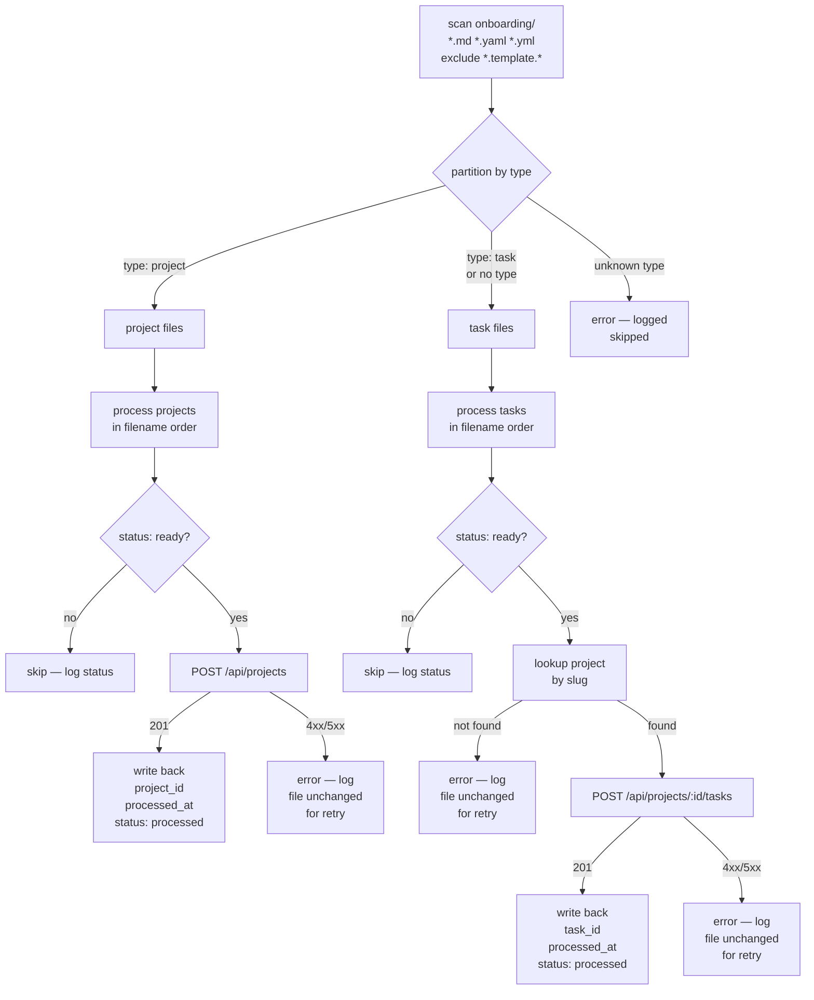
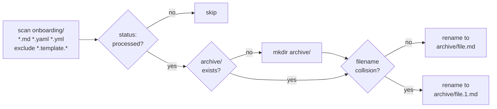
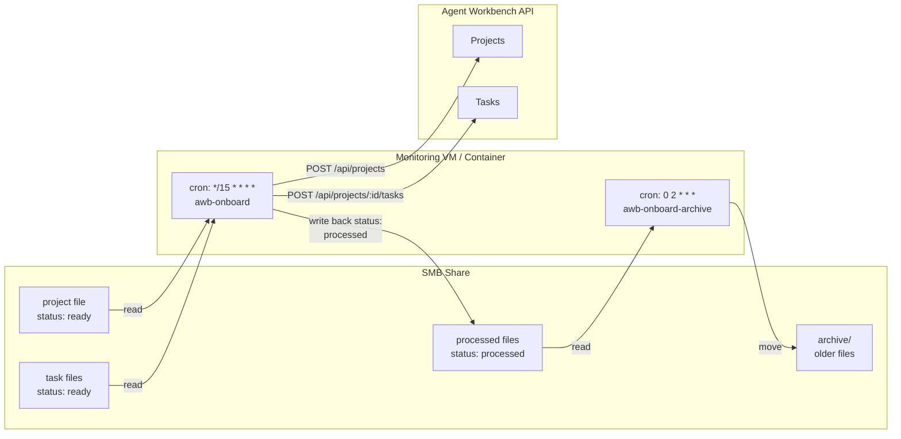

# Onboarding

The onboarding system lets humans author projects and tasks as files and have
them automatically registered in the Agent Workbench API. Files live in
`onboarding/` and are processed by `scripts/onboard.py`.

Two modes exist:

| Mode | Flag | Purpose |
|---|---|---|
| **Create pass** | _(default)_ | Read `ready` files, call the API, mark them `processed` |
| **Archive pass** | `--archive` | Move `processed` files to `onboarding/archive/` |

---

## File Formats

Two file formats are supported and can be mixed in the same batch:

| Format | Extensions | When to use |
|---|---|---|
| **Markdown with YAML front matter** | `*.md` | When you want a body (becomes task description) or prefer a readable narrative |
| **Pure YAML** | `*.yaml`, `*.yml` | For programmatic generation, bulk import, or when no body is needed |

For Markdown files, front matter sits between `---` delimiters at the top of
the file. For YAML files, the entire file is the record definition — put
`description:` directly in the YAML if a task description is needed.

Files matching `*.template.md` and `*.template.yaml` are always ignored.

---

## File Types

Every onboarding file declares its type in front matter. Two types are
supported; the type determines which API endpoint is called.

### `type: project`

Registers a new project via `POST /api/projects`.

**Markdown (`my-project.md`):**
```markdown
---
type: project
status: ready
name: "My Project"
slug: my-project
project_type: code
local_path: /shared/projects/dev/my-project
git_remote_url: https://github.com/org/my-project
environment: local
default_agent: opencode
---
Optional notes — not sent to the API.
```

**Pure YAML (`my-project.yaml`):**
```yaml
type: project
status: ready
name: My Project
slug: my-project
project_type: code
local_path: /shared/projects/dev/my-project
git_remote_url: https://github.com/org/my-project
environment: local
default_agent: opencode
```

| Field | Required | Values |
|---|---|---|
| `type` | yes | `project` |
| `status` | yes | `draft` · `ready` · `processed` |
| `name` | yes | human-readable display name |
| `slug` | yes | URL-safe unique identifier (lowercase, hyphens) |
| `project_type` | no | `code` · `course` · `content` · `research` · `infrastructure` · `other` |
| `local_path` | no | absolute path to the project on disk |
| `git_remote_url` | no | remote Git URL |
| `environment` | no | `local` · `dev` · `stage` · `prod` (default: `local`) |
| `default_agent` | no | agent name that works this project by default |

On success the script appends:
```yaml
project_id: <uuid>
processed_at: <iso8601>
```

### `type: task`

Creates a task in an existing project's inbox via
`POST /api/projects/{id}/tasks`. Omitting `type` defaults to `task` for
backward compatibility with files created before the `type` field existed.

**Markdown (`my-task.md`):**
```markdown
---
type: task
status: ready
title: "Write integration tests"
project: my-project
phase: testing
role: tester
model_tier: local
priority: 7
---
Describe the task here. This body becomes the task description.
```

**Pure YAML (`my-task.yaml`):**
```yaml
type: task
status: ready
title: Write integration tests
project: my-project
phase: testing
role: tester
model_tier: local
priority: 7
description: Describe the task here. Description must be inline for YAML files.
```

| Field | Required | Values |
|---|---|---|
| `type` | no | `task` (default when omitted) |
| `status` | yes | `draft` · `ready` · `processed` |
| `title` | yes | short task title |
| `project` | yes | project slug (must already exist in the workbench) |
| `phase` | no | `discovery` · `design` · `implementation` · `testing` · `review` (default: `discovery`) |
| `role` | no | `researcher` · `planner` · `implementer` · `writer` · `reviewer` · `tester` · `orchestrator` |
| `model_tier` | no | `cloud` · `local` (default: `cloud`) |
| `priority` | no | integer, higher = more urgent (default: `5`) |
| `description` | no | task description; for YAML files use this field; for Markdown files the body text is used |

On success the script appends:
```yaml
task_id: <uuid>
processed_at: <iso8601>
```

---

## File Lifecycle



---

## Processing Flow

Projects are always registered before tasks in the same run, so a project file
and its task files can be dropped into `onboarding/` together and processed
in a single batch.



---

## Archive Pass

The archive pass is a separate invocation — typically a nightly cron job —
that moves `status: processed` files out of the active `onboarding/` folder
into `onboarding/archive/`. This keeps the working directory tidy without
losing the record of what was created.

`onboarding/archive/` is created automatically on the first run. Template
files (`*.template.md`, `*.template.yaml`) are never touched. Both Markdown
and YAML files are archived by the same pass. If a destination filename already
exists in the archive, a numeric suffix is appended (`.1`, `.2`, …) to avoid
silent overwrites.



---

## Local Usage

Templates are in `onboarding/`. Copy one, fill it in, set `status: ready`.

```bash
# Copy the relevant template
cp onboarding/project.template.md onboarding/my-project.md
cp onboarding/task.template.md onboarding/my-task.md

# Process ready files (API must be running on localhost:8000)
make onboard

# Preview without making any changes
ONBOARD_DRY_RUN=1 make onboard

# Run the archive pass
make onboard-archive

# Override the API URL
AWB_API_URL=http://awb-api:8000 make onboard
```

---

## Server / Container Install

For an always-on monitoring setup (e.g. watching an SMB share), install
self-contained stub scripts using `scripts/install-onboard.sh`. The stubs
delegate to the repo file so updates are live without reinstalling.

```bash
bash scripts/install-onboard.sh \
  --install-dir /usr/local/bin \
  --onboarding-dir /mnt/smb/onboarding \
  --api-url http://awb-api:8000
```

This writes two stubs:

| Stub | Purpose |
|---|---|
| `awb-onboard` | Normal create pass |
| `awb-onboard-archive` | Archive pass |

Both accept `--dry-run` for previewing without changes.



---

## Options Reference

```
uv run scripts/onboard.py [OPTIONS]

  --onboarding-dir DIR   Directory to scan (default: onboarding/)
  --api-url URL          Agent Workbench API URL (default: http://localhost:8000)
  --dry-run              Preview without creating records or modifying files
  --archive              Archive pass: move processed files to <onboarding-dir>/archive/
```

---

## Templates

| Template | Use |
|---|---|
| `onboarding/project.template.md` | Starting point for a `type: project` file |
| `onboarding/task.template.md` | Starting point for a `type: task` file |

Template files are always ignored by the onboarding script.
